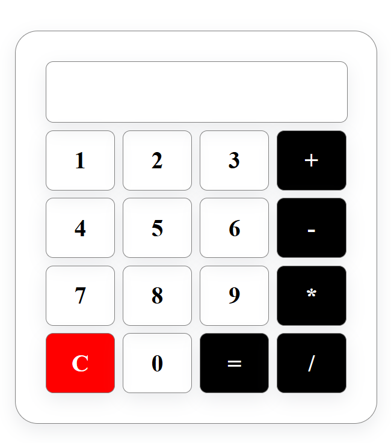

# Basic-Calculator

The mini project that is equipped with all the basic functionalities of a calculator and gives the accurate results.

This calculator looks like the image shown: It has the following functionalities:

- It supports all the basic mathematical operations: Addition, Subtraction, Division, Multiplication
- It can do the combination of operations with different numbers like a real calculator.
- The AC button resets and clears the data.
- The _=_ button gives the result of the operation.

Things it cannot support:

- [] Cannot show Error messages
- [] Allows other mathematical operators beside without replacing the previous operator.

